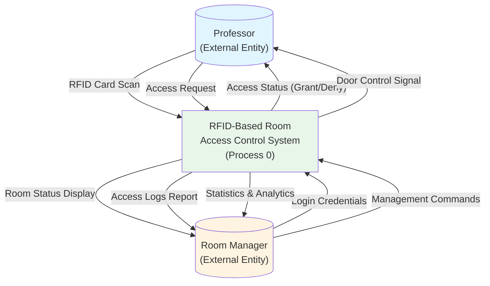
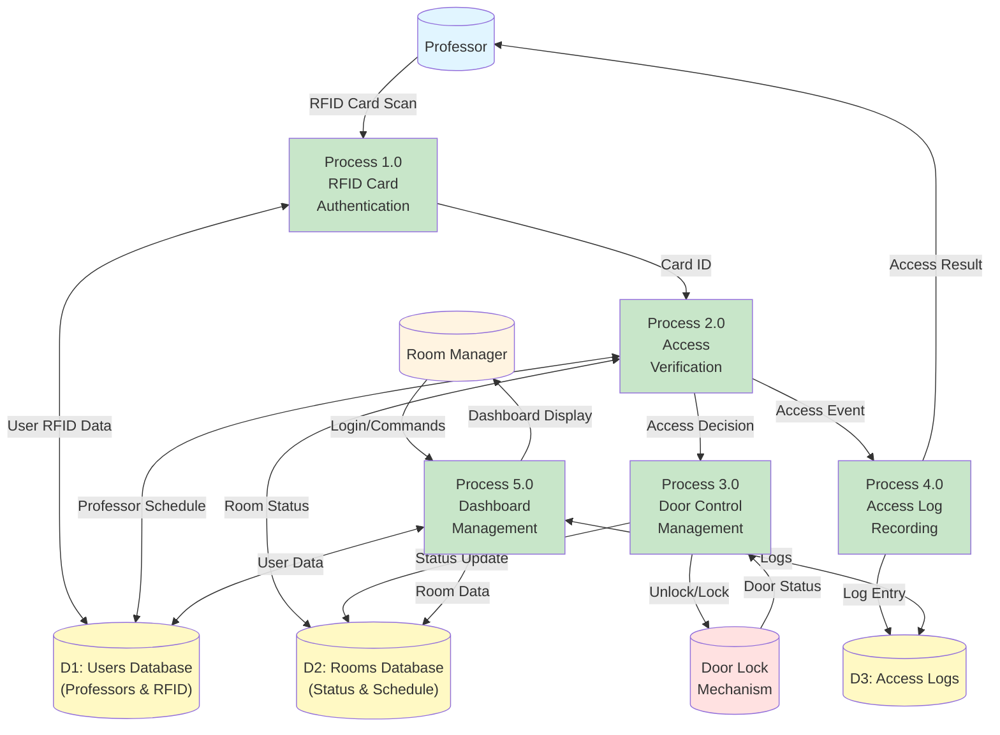
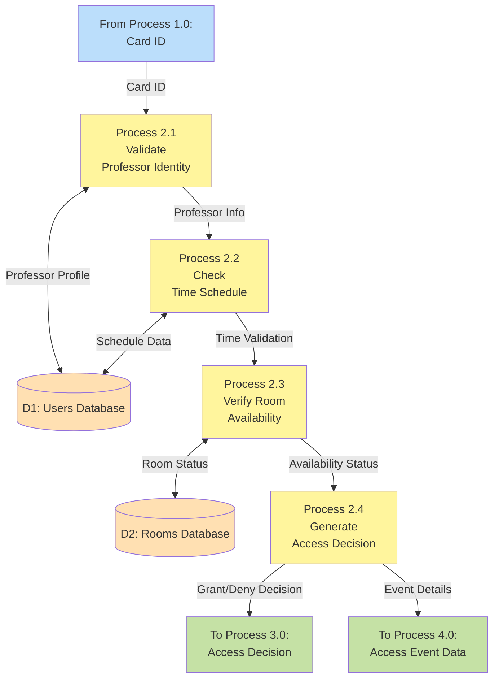
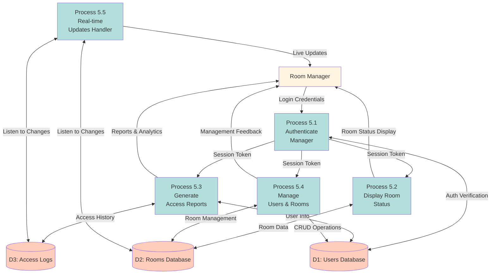

# Data Flow Diagrams - RFID Room Access Control System

## Overview
This document contains comprehensive Data Flow Diagrams (DFDs) for the RFID-Based Room Access Control System, showing how data flows through the system at different levels of abstraction.

---

## Level 0 - Context Diagram

The context diagram shows the system as a single process with external entities.

### Mermaid Code:


### Data Flow Description:

| From | To | Data |
|------|-----|------|
| Professor | System | RFID Card Scan, Access Request |
| System | Professor | Access Status (Granted/Denied), Door Control Signal |
| Room Manager | System | Login Credentials, Management Commands |
| System | Room Manager | Room Status Display, Access Logs, Statistics |

---

## Level 1 - Data Flow Diagram

Shows the major processes and data stores within the system.

### Mermaid Code:


### Process Descriptions:

| Process | Name | Description |
|---------|------|-------------|
| 1.0 | RFID Card Authentication | Reads RFID card and validates card ID against database |
| 2.0 | Access Verification | Checks professor schedule, room availability, and time constraints |
| 3.0 | Door Control Management | Controls door lock mechanism based on access decision |
| 4.0 | Access Log Recording | Records all access attempts with timestamps and status |
| 5.0 | Dashboard Management | Manages room manager interface and displays real-time data |

---

## Level 2 - Access Verification Process (Process 2.0)

Detailed breakdown of the Access Verification process.

### Mermaid Code:


### Sub-Process Descriptions:

| Process | Name | Input | Output |
|---------|------|-------|--------|
| 2.1 | Validate Professor Identity | Card ID | Professor Info (name, email, department) |
| 2.2 | Check Time Schedule | Professor Info, Current Time | Time Validation Result |
| 2.3 | Verify Room Availability | Time Validation, Room Status | Availability Status |
| 2.4 | Generate Access Decision | All Validation Results | Access Decision (Grant/Deny) |

---

## Level 2 - Dashboard Management (Process 5.0)

Detailed breakdown of the Dashboard Management process.

### Mermaid Code:


### Sub-Process Descriptions:

| Process | Name | Function |
|---------|------|----------|
| 5.1 | Authenticate Manager | Validates manager login credentials using Firebase Auth |
| 5.2 | Display Room Status | Shows real-time room occupancy with color indicators |
| 5.3 | Generate Access Reports | Creates filtered reports and analytics from access logs |
| 5.4 | Manage Users & Rooms | CRUD operations for professors, rooms, and schedules |
| 5.5 | Real-time Updates Handler | Listens to Firebase streams and pushes live updates |

---

## Data Store Specifications

### D1: Users Database (Firebase Firestore)

**Structure:**
```
/users/{user_id}
  - name: String
  - email: String
  - rfid_id: String (unique)
  - department: String
  - role: String (Admin/Professor/Agent)
  - schedule: Map
    - monday: Array[String]
    - tuesday: Array[String]
    - ...
```

**Operations:**
- Read: Card validation, schedule checking, dashboard display
- Write: User registration, schedule updates
- Update: Profile modifications
- Delete: User removal (Admin only)

### D2: Rooms Database (Firebase Firestore)

**Structure:**
```
/rooms/{room_id}
  - room_name: String
  - status: String (available/occupied/maintenance)
  - current_user: String (null or user_id)
  - capacity: Number
  - last_access: Timestamp
```

**Operations:**
- Read: Status checking, availability verification
- Write: Initial room setup
- Update: Status changes, occupancy updates
- Delete: Room removal (Admin only)

### D3: Access Logs (Firebase Firestore)

**Structure:**
```
/access_logs/{log_id}
  - user_id: String
  - user_name: String
  - room_id: String
  - timestamp: Timestamp
  - status: String (granted/denied)
  - reason: String
```

**Operations:**
- Read: Report generation, audit trails
- Write: Log creation on every access attempt
- Update: Not applicable (logs are immutable)
- Delete: Archival after retention period

---

## Data Dictionary

| Data Element | Description | Type | Example |
|-------------|-------------|------|---------|
| card_id | Unique RFID card identifier | String | "E3F29A4B" |
| user_id | Unique professor identifier | String | "prof_1234" |
| room_id | Unique room identifier | String | "room_A" |
| timestamp | Date and time of event | DateTime | "2025-11-13T09:05:00Z" |
| access_status | Result of access attempt | Enum | "granted", "denied" |
| room_status | Current state of room | Enum | "available", "occupied" |
| schedule | Time slots for access | Array | ["09:00-11:00", "14:00-16:00"] |
| session_token | Manager authentication token | String | JWT token |

---

## Data Flow Scenarios

### Scenario 1: Successful Access
1. Professor scans RFID card
2. Card ID sent to Authentication (P1.0)
3. Card validated against Users DB (D1)
4. Access Verification (P2.0) checks:
   - Professor identity ✓
   - Current time vs schedule ✓
   - Room availability ✓
5. Access granted sent to Door Control (P3.0)
6. Door unlocks
7. Access logged in D3
8. Dashboard updated in real-time

### Scenario 2: Access Denied (Wrong Time)
1. Professor scans RFID card
2. Card ID validated ✓
3. Schedule check fails ✗
4. Access denied
5. Red LED feedback
6. Denial logged in D3
7. Dashboard shows denied attempt

### Scenario 3: Manager Views Reports
1. Manager logs into dashboard
2. Authentication verified (P5.1)
3. Dashboard displays room status (P5.2)
4. Manager requests access report
5. Report generated from D3 (P5.3)
6. Report displayed with filters

---

## Integration Points

### Arduino ↔ Firebase
- **Protocol:** HTTPS REST API
- **Data Format:** JSON
- **Frequency:** On card scan (event-driven)
- **Latency:** < 1 second

### Flutter Dashboard ↔ Firebase
- **Protocol:** WebSocket (Firestore streams)
- **Data Format:** JSON
- **Frequency:** Real-time (continuous)
- **Latency:** < 500ms

### Arduino ↔ Door Lock
- **Protocol:** Digital GPIO
- **Data Format:** High/Low signal
- **Frequency:** On access decision
- **Duration:** 5-10 seconds unlock

---

## Security Considerations

1. **Data in Transit**: All Firebase communication uses TLS/SSL encryption
2. **Authentication**: Manager dashboard requires Firebase Authentication
3. **Authorization**: Firestore security rules enforce role-based access
4. **Audit Trail**: All access attempts logged with immutable timestamps
5. **RFID Security**: Card IDs stored as hashed values (optional enhancement)

---

## Performance Metrics

| Metric | Target | Current |
|--------|--------|---------|
| Card Read Time | < 500ms | 300ms |
| Firebase Response | < 1s | 800ms |
| Door Unlock Delay | < 2s | 1.5s |
| Dashboard Update | < 1s | 600ms |
| Log Write Time | < 500ms | 400ms |

---

## Conclusion

These Data Flow Diagrams provide a comprehensive view of how data moves through the RFID-Based Room Access Control System. The multi-level approach allows stakeholders to understand the system at different levels of detail, from high-level context to specific process breakdowns.
